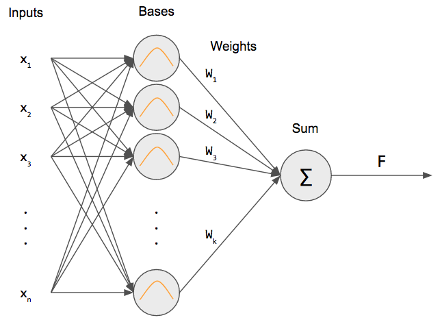
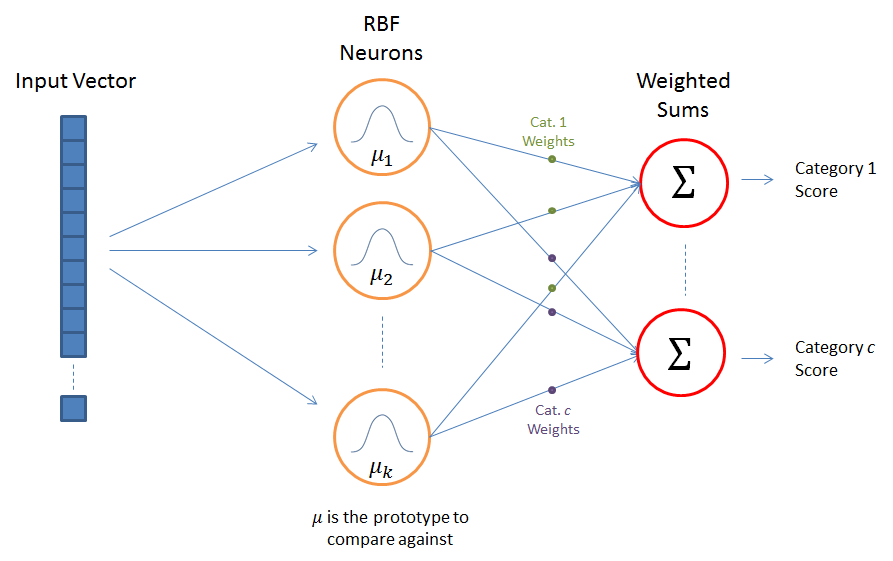
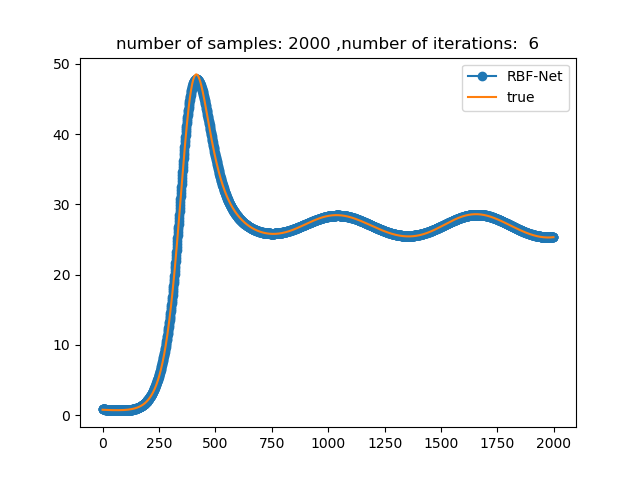

# RBF Neural Network Evolutionary Training
In this project, I implemented and train a network to do regression, binary classification and multi class classification.
I used evolutionary strategy for training.

In this implementation, the length of chromosome is not fixed, and the algorithm finds the optimum one(find the optimum number of bases).

List of contents:
- [Evolutionary Strategy (ES) Parameters](#Evolutionary-Strategy-Parameters)
- [Network Architecture](#Network-Architecture)
- [How to use](#How-to-use)
- [Some Results](#Some-Results)

## Evolutionary Strategy Parameters
### Representation
If your data is two dimensional:
```
<σ,x1,y1,r1,x2,y2,r2,...>
```

### Initial Population
I selected them randomly and uniformly.

### Mutation
I change `τ` by random normal distribution.

```
σ’ = σ • exp(τ • N(0,1))
x’i = xi + σ’ • N(0,1)
```

**Note** that `τ α 1/ n½`

### Crossover
It just produce one child.

I assigned `Pc=0.4`

### Survivors selection
I use `μ+λ` and `q-tournament` methods.I take `λ≈7μ` and `q=5`.

### Fitness
- Regression:
```
e = 0.5 . Transpose(y-y*) . (y-y*)    fitness = 1/e
```
- Binary classifier:
```
fitness = 1-sum(abs(sign(y)-y*))/2L
```
- Multi classifier:
```
fitness = 1-sum(sign(abs(indexMax(y)-indexMax(y*)))))/L
```
I used `one-hot encoding` in multi classification.

## Network Architecture
You can see the network architecture for regression below:




You can see the network architecture for multi class classifier below:



## How to use
You see how I'm used it in `run.py`.
### Feed Data
You feed xlsx data by `read_excel` method.

## Some Results
The result of the dataset in `dataset` folder, is shown below:

- Regression:

 
```
error: 7%
```

- Classification:

.png) 

.png) 

.png) 

.png) 

```
precision: 95%
```